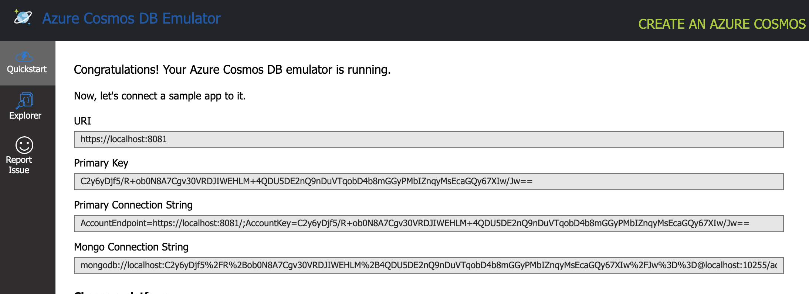

## Project

This is a bug demo documenting the problem faced following https://www.baeldung.com/spring-data-cosmos-db 

## Set up

I have the Cosmos emulator set up on https://localhost:10250/_explorer/index.html


## Error log

Lead to this problem with no Satisfactory solution  

https://stackoverflow.com/q/65183926/5777189
```
/Users/myusername/Library/Java/JavaVirtualMachines/semeru-11.0.13-1/Contents/Home/bin/java -ea -Didea.test.cyclic.buffer.size=1048576 -javaagent:/Applications/IntelliJ IDEA CE.app/Contents/lib/idea_rt.jar=50129:/Applications/IntelliJ IDEA CE.app/Contents/bin -Dfile.encoding=UTF-8 -classpath /Users/myusername/.m2/repository/org/junit/platform/junit-platform-launcher/1.8.2/junit-platform-launcher-1.8.2.jar:/Applications/IntelliJ IDEA CE.app/Contents/lib/idea_rt.jar:/Applications/IntelliJ IDEA CE.app/Contents/plugins/junit/lib/junit5-rt.jar:/Applications/IntelliJ IDEA CE.app/Contents/plugins/junit/lib/junit-rt.jar:/Users/myusername/Documents/codingFiles/BackendLearning/cosmosdbconnect/target/test-classes:/Users/myusername/Documents/codingFiles/BackendLearning/cosmosdbconnect/target/classes:/Users/myusername/.m2/repository/org/springframework/boot/spring-boot-starter-web/2.6.3/spring-boot-starter-web-2.6.3.jar:/Users/myusername/.m2/repository/org/springframework/boot/spring-boot-starter/2.6.3/spring-boot-starter-2.6.3.jar:/Users/myusername/.m2/repository/org/springframework/boot/spring-boot/2.6.3/spring-boot-2.6.3.jar:/Users/myusername/.m2/repository/org/springframework/boot/spring-boot-autoconfigure/2.6.3/spring-boot-autoconfigure-2.6.3.jar:/Users/myusername/.m2/repository/org/springframework/boot/spring-boot-starter-logging/2.6.3/spring-boot-starter-logging-2.6.3.jar:/Users/myusername/.m2/repository/ch/qos/logback/logback-classic/1.2.10/logback-classic-1.2.10.jar:/Users/myusername/.m2/repository/ch/qos/logback/logback-core/1.2.10/logback-core-1.2.10.jar:/Users/myusername/.m2/repository/org/apache/logging/log4j/log4j-to-slf4j/2.17.1/log4j-to-slf4j-2.17.1.jar:/Users/myusername/.m2/repository/org/apache/logging/log4j/log4j-api/2.17.1/log4j-api-2.17.1.jar:/Users/myusername/.m2/repository/org/slf4j/jul-to-slf4j/1.7.33/jul-to-slf4j-1.7.33.jar:/Users/myusername/.m2/repository/jakarta/annotation/jakarta.annotation-api/1.3.5/jakarta.annotation-api-1.3.5.jar:/Users/myusername/.m2/repository/org/yaml/snakeyaml/1.29/snakeyaml-1.29.jar:/Users/myusername/.m2/repository/org/springframework/boot/spring-boot-starter-json/2.6.3/spring-boot-starter-json-2.6.3.jar:/Users/myusername/.m2/repository/com/fasterxml/jackson/core/jackson-databind/2.13.1/jackson-databind-2.13.1.jar:/Users/myusername/.m2/repository/org/springframework/boot/spring-boot-starter-tomcat/2.6.3/spring-boot-starter-tomcat-2.6.3.jar:/Users/myusername/.m2/repository/org/apache/tomcat/embed/tomcat-embed-core/9.0.56/tomcat-embed-core-9.0.56.jar:/Users/myusername/.m2/repository/org/apache/tomcat/embed/tomcat-embed-el/9.0.56/tomcat-embed-el-9.0.56.jar:/Users/myusername/.m2/repository/org/apache/tomcat/embed/tomcat-embed-websocket/9.0.56/tomcat-embed-websocket-9.0.56.jar:/Users/myusername/.m2/repository/org/springframework/spring-web/5.3.15/spring-web-5.3.15.jar:/Users/myusername/.m2/repository/org/springframework/spring-webmvc/5.3.15/spring-webmvc-5.3.15.jar:/Users/myusername/.m2/repository/org/springframework/spring-aop/5.3.15/spring-aop-5.3.15.jar:/Users/myusername/.m2/repository/org/springframework/boot/spring-boot-starter-test/2.6.3/spring-boot-starter-test-2.6.3.jar:/Users/myusername/.m2/repository/org/springframework/boot/spring-boot-test/2.6.3/spring-boot-test-2.6.3.jar:/Users/myusername/.m2/repository/org/springframework/boot/spring-boot-test-autoconfigure/2.6.3/spring-boot-test-autoconfigure-2.6.3.jar:/Users/myusername/.m2/repository/com/jayway/jsonpath/json-path/2.6.0/json-path-2.6.0.jar:/Users/myusername/.m2/repository/net/minidev/json-smart/2.4.7/json-smart-2.4.7.jar:/Users/myusername/.m2/repository/net/minidev/accessors-smart/2.4.7/accessors-smart-2.4.7.jar:/Users/myusername/.m2/repository/org/ow2/asm/asm/9.1/asm-9.1.jar:/Users/myusername/.m2/repository/org/slf4j/slf4j-api/1.7.33/slf4j-api-1.7.33.jar:/Users/myusername/.m2/repository/jakarta/xml/bind/jakarta.xml.bind-api/2.3.3/jakarta.xml.bind-api-2.3.3.jar:/Users/myusername/.m2/repository/jakarta/activation/jakarta.activation-api/1.2.2/jakarta.activation-api-1.2.2.jar:/Users/myusername/.m2/repository/org/assertj/assertj-core/3.21.0/assertj-core-3.21.0.jar:/Users/myusername/.m2/repository/org/hamcrest/hamcrest/2.2/hamcrest-2.2.jar:/Users/myusername/.m2/repository/org/junit/jupiter/junit-jupiter/5.8.2/junit-jupiter-5.8.2.jar:/Users/myusername/.m2/repository/org/junit/jupiter/junit-jupiter-api/5.8.2/junit-jupiter-api-5.8.2.jar:/Users/myusername/.m2/repository/org/opentest4j/opentest4j/1.2.0/opentest4j-1.2.0.jar:/Users/myusername/.m2/repository/org/junit/platform/junit-platform-commons/1.8.2/junit-platform-commons-1.8.2.jar:/Users/myusername/.m2/repository/org/apiguardian/apiguardian-api/1.1.2/apiguardian-api-1.1.2.jar:/Users/myusername/.m2/repository/org/junit/jupiter/junit-jupiter-params/5.8.2/junit-jupiter-params-5.8.2.jar:/Users/myusername/.m2/repository/org/junit/jupiter/junit-jupiter-engine/5.8.2/junit-jupiter-engine-5.8.2.jar:/Users/myusername/.m2/repository/org/junit/platform/junit-platform-engine/1.8.2/junit-platform-engine-1.8.2.jar:/Users/myusername/.m2/repository/org/mockito/mockito-core/4.0.0/mockito-core-4.0.0.jar:/Users/myusername/.m2/repository/net/bytebuddy/byte-buddy/1.11.22/byte-buddy-1.11.22.jar:/Users/myusername/.m2/repository/net/bytebuddy/byte-buddy-agent/1.11.22/byte-buddy-agent-1.11.22.jar:/Users/myusername/.m2/repository/org/objenesis/objenesis/3.2/objenesis-3.2.jar:/Users/myusername/.m2/repository/org/mockito/mockito-junit-jupiter/4.0.0/mockito-junit-jupiter-4.0.0.jar:/Users/myusername/.m2/repository/org/skyscreamer/jsonassert/1.5.0/jsonassert-1.5.0.jar:/Users/myusername/.m2/repository/com/vaadin/external/google/android-json/0.0.20131108.vaadin1/android-json-0.0.20131108.vaadin1.jar:/Users/myusername/.m2/repository/org/springframework/spring-core/5.3.15/spring-core-5.3.15.jar:/Users/myusername/.m2/repository/org/springframework/spring-jcl/5.3.15/spring-jcl-5.3.15.jar:/Users/myusername/.m2/repository/org/springframework/spring-test/5.3.15/spring-test-5.3.15.jar:/Users/myusername/.m2/repository/org/xmlunit/xmlunit-core/2.8.4/xmlunit-core-2.8.4.jar:/Users/myusername/.m2/repository/com/microsoft/azure/spring-data-cosmosdb/2.3.0/spring-data-cosmosdb-2.3.0.jar:/Users/myusername/.m2/repository/org/springframework/spring-beans/5.3.15/spring-beans-5.3.15.jar:/Users/myusername/.m2/repository/org/springframework/spring-context/5.3.15/spring-context-5.3.15.jar:/Users/myusername/.m2/repository/org/springframework/spring-tx/5.3.15/spring-tx-5.3.15.jar:/Users/myusername/.m2/repository/org/springframework/data/spring-data-commons/2.6.1/spring-data-commons-2.6.1.jar:/Users/myusername/.m2/repository/org/springframework/spring-expression/5.3.15/spring-expression-5.3.15.jar:/Users/myusername/.m2/repository/com/microsoft/azure/azure-cosmos/3.7.3/azure-cosmos-3.7.3.jar:/Users/myusername/.m2/repository/com/fasterxml/uuid/java-uuid-generator/3.2.0/java-uuid-generator-3.2.0.jar:/Users/myusername/.m2/repository/commons-io/commons-io/2.5/commons-io-2.5.jar:/Users/myusername/.m2/repository/commons-validator/commons-validator/1.6/commons-validator-1.6.jar:/Users/myusername/.m2/repository/commons-digester/commons-digester/1.8.1/commons-digester-1.8.1.jar:/Users/myusername/.m2/repository/commons-logging/commons-logging/1.2/commons-logging-1.2.jar:/Users/myusername/.m2/repository/commons-collections/commons-collections/3.2.2/commons-collections-3.2.2.jar:/Users/myusername/.m2/repository/io/projectreactor/reactor-core/3.4.14/reactor-core-3.4.14.jar:/Users/myusername/.m2/repository/org/reactivestreams/reactive-streams/1.0.3/reactive-streams-1.0.3.jar:/Users/myusername/.m2/repository/io/netty/netty-codec-http/4.1.73.Final/netty-codec-http-4.1.73.Final.jar:/Users/myusername/.m2/repository/io/netty/netty-common/4.1.73.Final/netty-common-4.1.73.Final.jar:/Users/myusername/.m2/repository/io/netty/netty-buffer/4.1.73.Final/netty-buffer-4.1.73.Final.jar:/Users/myusername/.m2/repository/io/netty/netty-transport/4.1.73.Final/netty-transport-4.1.73.Final.jar:/Users/myusername/.m2/repository/io/netty/netty-codec/4.1.73.Final/netty-codec-4.1.73.Final.jar:/Users/myusername/.m2/repository/io/netty/netty-handler/4.1.73.Final/netty-handler-4.1.73.Final.jar:/Users/myusername/.m2/repository/io/netty/netty-resolver/4.1.73.Final/netty-resolver-4.1.73.Final.jar:/Users/myusername/.m2/repository/io/netty/netty-tcnative-classes/2.0.46.Final/netty-tcnative-classes-2.0.46.Final.jar:/Users/myusername/.m2/repository/org/apache/commons/commons-lang3/3.12.0/commons-lang3-3.12.0.jar:/Users/myusername/.m2/repository/org/apache/commons/commons-collections4/4.2/commons-collections4-4.2.jar:/Users/myusername/.m2/repository/org/apache/commons/commons-text/1.6/commons-text-1.6.jar:/Users/myusername/.m2/repository/com/google/guava/guava/25.0-jre/guava-25.0-jre.jar:/Users/myusername/.m2/repository/com/google/code/findbugs/jsr305/1.3.9/jsr305-1.3.9.jar:/Users/myusername/.m2/repository/org/checkerframework/checker-compat-qual/2.0.0/checker-compat-qual-2.0.0.jar:/Users/myusername/.m2/repository/com/google/errorprone/error_prone_annotations/2.1.3/error_prone_annotations-2.1.3.jar:/Users/myusername/.m2/repository/com/google/j2objc/j2objc-annotations/1.1/j2objc-annotations-1.1.jar:/Users/myusername/.m2/repository/org/codehaus/mojo/animal-sniffer-annotations/1.14/animal-sniffer-annotations-1.14.jar:/Users/myusername/.m2/repository/io/dropwizard/metrics/metrics-core/4.2.7/metrics-core-4.2.7.jar:/Users/myusername/.m2/repository/io/micrometer/micrometer-core/1.8.2/micrometer-core-1.8.2.jar:/Users/myusername/.m2/repository/org/hdrhistogram/HdrHistogram/2.1.12/HdrHistogram-2.1.12.jar:/Users/myusername/.m2/repository/org/latencyutils/LatencyUtils/2.0.3/LatencyUtils-2.0.3.jar:/Users/myusername/.m2/repository/io/reactivex/rxjava2/rxjava/2.2.21/rxjava-2.2.21.jar:/Users/myusername/.m2/repository/io/projectreactor/netty/reactor-netty/1.0.15/reactor-netty-1.0.15.jar:/Users/myusername/.m2/repository/io/projectreactor/netty/reactor-netty-core/1.0.15/reactor-netty-core-1.0.15.jar:/Users/myusername/.m2/repository/io/netty/netty-handler-proxy/4.1.73.Final/netty-handler-proxy-4.1.73.Final.jar:/Users/myusername/.m2/repository/io/netty/netty-codec-socks/4.1.73.Final/netty-codec-socks-4.1.73.Final.jar:/Users/myusername/.m2/repository/io/netty/netty-resolver-dns/4.1.73.Final/netty-resolver-dns-4.1.73.Final.jar:/Users/myusername/.m2/repository/io/netty/netty-codec-dns/4.1.73.Final/netty-codec-dns-4.1.73.Final.jar:/Users/myusername/.m2/repository/io/netty/netty-resolver-dns-native-macos/4.1.73.Final/netty-resolver-dns-native-macos-4.1.73.Final-osx-x86_64.jar:/Users/myusername/.m2/repository/io/netty/netty-resolver-dns-classes-macos/4.1.73.Final/netty-resolver-dns-classes-macos-4.1.73.Final.jar:/Users/myusername/.m2/repository/io/netty/netty-transport-native-epoll/4.1.73.Final/netty-transport-native-epoll-4.1.73.Final-linux-x86_64.jar:/Users/myusername/.m2/repository/io/netty/netty-transport-native-unix-common/4.1.73.Final/netty-transport-native-unix-common-4.1.73.Final.jar:/Users/myusername/.m2/repository/io/netty/netty-transport-classes-epoll/4.1.73.Final/netty-transport-classes-epoll-4.1.73.Final.jar:/Users/myusername/.m2/repository/io/projectreactor/netty/reactor-netty-http/1.0.15/reactor-netty-http-1.0.15.jar:/Users/myusername/.m2/repository/io/netty/netty-codec-http2/4.1.73.Final/netty-codec-http2-4.1.73.Final.jar:/Users/myusername/.m2/repository/io/projectreactor/netty/incubator/reactor-netty-incubator-quic/0.0.4/reactor-netty-incubator-quic-0.0.4.jar:/Users/myusername/.m2/repository/io/netty/incubator/netty-incubator-codec-native-quic/0.0.25.Final/netty-incubator-codec-native-quic-0.0.25.Final-linux-x86_64.jar:/Users/myusername/.m2/repository/io/netty/incubator/netty-incubator-codec-classes-quic/0.0.25.Final/netty-incubator-codec-classes-quic-0.0.25.Final.jar:/Users/myusername/.m2/repository/commons-codec/commons-codec/1.15/commons-codec-1.15.jar:/Users/myusername/.m2/repository/io/projectreactor/netty/reactor-netty-http-brave/1.0.15/reactor-netty-http-brave-1.0.15.jar:/Users/myusername/.m2/repository/io/zipkin/brave/brave-instrumentation-http/5.13.7/brave-instrumentation-http-5.13.7.jar:/Users/myusername/.m2/repository/io/zipkin/brave/brave/5.13.7/brave-5.13.7.jar:/Users/myusername/.m2/repository/io/zipkin/reporter2/zipkin-reporter-brave/2.16.3/zipkin-reporter-brave-2.16.3.jar:/Users/myusername/.m2/repository/io/zipkin/reporter2/zipkin-reporter/2.16.3/zipkin-reporter-2.16.3.jar:/Users/myusername/.m2/repository/io/zipkin/zipkin2/zipkin/2.23.2/zipkin-2.23.2.jar:/Users/myusername/.m2/repository/com/fasterxml/jackson/module/jackson-module-parameter-names/2.13.1/jackson-module-parameter-names-2.13.1.jar:/Users/myusername/.m2/repository/com/fasterxml/jackson/core/jackson-core/2.13.1/jackson-core-2.13.1.jar:/Users/myusername/.m2/repository/com/fasterxml/jackson/datatype/jackson-datatype-jdk8/2.13.1/jackson-datatype-jdk8-2.13.1.jar:/Users/myusername/.m2/repository/com/fasterxml/jackson/datatype/jackson-datatype-jsr310/2.13.1/jackson-datatype-jsr310-2.13.1.jar:/Users/myusername/.m2/repository/com/fasterxml/jackson/core/jackson-annotations/2.13.1/jackson-annotations-2.13.1.jar:/Users/myusername/.m2/repository/org/json/json/20140107/json-20140107.jar:/Users/myusername/.m2/repository/org/javatuples/javatuples/1.2/javatuples-1.2.jar com.intellij.rt.junit.JUnitStarter -ideVersion5 -junit5 com.example.cosmosdbconnect.AzureCosmosDbApplicationManualTest,givenProductIsCreated_whenCallFindById_thenProductIsFound
22:10:53.279 [main] DEBUG org.springframework.test.context.BootstrapUtils - Instantiating CacheAwareContextLoaderDelegate from class [org.springframework.test.context.cache.DefaultCacheAwareContextLoaderDelegate]
22:10:53.312 [main] DEBUG org.springframework.test.context.BootstrapUtils - Instantiating BootstrapContext using constructor [public org.springframework.test.context.support.DefaultBootstrapContext(java.lang.Class,org.springframework.test.context.CacheAwareContextLoaderDelegate)]
22:10:53.358 [main] DEBUG org.springframework.test.context.BootstrapUtils - Instantiating TestContextBootstrapper for test class [com.example.cosmosdbconnect.AzureCosmosDbApplicationManualTest] from class [org.springframework.boot.test.context.SpringBootTestContextBootstrapper]
22:10:53.376 [main] INFO org.springframework.boot.test.context.SpringBootTestContextBootstrapper - Neither @ContextConfiguration nor @ContextHierarchy found for test class [com.example.cosmosdbconnect.AzureCosmosDbApplicationManualTest], using SpringBootContextLoader
22:10:53.381 [main] DEBUG org.springframework.test.context.support.AbstractContextLoader - Did not detect default resource location for test class [com.example.cosmosdbconnect.AzureCosmosDbApplicationManualTest]: class path resource [com/example/cosmosdbconnect/AzureCosmosDbApplicationManualTest-context.xml] does not exist
22:10:53.382 [main] DEBUG org.springframework.test.context.support.AbstractContextLoader - Did not detect default resource location for test class [com.example.cosmosdbconnect.AzureCosmosDbApplicationManualTest]: class path resource [com/example/cosmosdbconnect/AzureCosmosDbApplicationManualTestContext.groovy] does not exist
22:10:53.382 [main] INFO org.springframework.test.context.support.AbstractContextLoader - Could not detect default resource locations for test class [com.example.cosmosdbconnect.AzureCosmosDbApplicationManualTest]: no resource found for suffixes {-context.xml, Context.groovy}.
22:10:53.383 [main] INFO org.springframework.test.context.support.AnnotationConfigContextLoaderUtils - Could not detect default configuration classes for test class [com.example.cosmosdbconnect.AzureCosmosDbApplicationManualTest]: AzureCosmosDbApplicationManualTest does not declare any static, non-private, non-final, nested classes annotated with @Configuration.
22:10:53.432 [main] DEBUG org.springframework.test.context.support.ActiveProfilesUtils - Could not find an 'annotation declaring class' for annotation type [org.springframework.test.context.ActiveProfiles] and class [com.example.cosmosdbconnect.AzureCosmosDbApplicationManualTest]
22:10:53.536 [main] DEBUG org.springframework.context.annotation.ClassPathScanningCandidateComponentProvider - Identified candidate component class: file [/Users/myusername/Documents/codingFiles/BackendLearning/cosmosdbconnect/target/classes/com/example/cosmosdbconnect/CosmosdbconnectApplication.class]
22:10:53.542 [main] INFO org.springframework.boot.test.context.SpringBootTestContextBootstrapper - Found @SpringBootConfiguration com.example.cosmosdbconnect.CosmosdbconnectApplication for test class com.example.cosmosdbconnect.AzureCosmosDbApplicationManualTest
22:10:53.658 [main] DEBUG org.springframework.boot.test.context.SpringBootTestContextBootstrapper - @TestExecutionListeners is not present for class [com.example.cosmosdbconnect.AzureCosmosDbApplicationManualTest]: using defaults.
22:10:53.658 [main] INFO org.springframework.boot.test.context.SpringBootTestContextBootstrapper - Loaded default TestExecutionListener class names from location [META-INF/spring.factories]: [org.springframework.boot.test.mock.mockito.MockitoTestExecutionListener, org.springframework.boot.test.mock.mockito.ResetMocksTestExecutionListener, org.springframework.boot.test.autoconfigure.restdocs.RestDocsTestExecutionListener, org.springframework.boot.test.autoconfigure.web.client.MockRestServiceServerResetTestExecutionListener, org.springframework.boot.test.autoconfigure.web.servlet.MockMvcPrintOnlyOnFailureTestExecutionListener, org.springframework.boot.test.autoconfigure.web.servlet.WebDriverTestExecutionListener, org.springframework.boot.test.autoconfigure.webservices.client.MockWebServiceServerTestExecutionListener, org.springframework.test.context.web.ServletTestExecutionListener, org.springframework.test.context.support.DirtiesContextBeforeModesTestExecutionListener, org.springframework.test.context.event.ApplicationEventsTestExecutionListener, org.springframework.test.context.support.DependencyInjectionTestExecutionListener, org.springframework.test.context.support.DirtiesContextTestExecutionListener, org.springframework.test.context.transaction.TransactionalTestExecutionListener, org.springframework.test.context.jdbc.SqlScriptsTestExecutionListener, org.springframework.test.context.event.EventPublishingTestExecutionListener]
22:10:53.681 [main] INFO org.springframework.boot.test.context.SpringBootTestContextBootstrapper - Using TestExecutionListeners: [org.springframework.test.context.web.ServletTestExecutionListener@f062f548, org.springframework.test.context.support.DirtiesContextBeforeModesTestExecutionListener@9e207afd, org.springframework.test.context.event.ApplicationEventsTestExecutionListener@8b787c94, org.springframework.boot.test.mock.mockito.MockitoTestExecutionListener@34827260, org.springframework.boot.test.autoconfigure.SpringBootDependencyInjectionTestExecutionListener@7b3bdf7e, org.springframework.test.context.support.DirtiesContextTestExecutionListener@6791ad16, org.springframework.test.context.transaction.TransactionalTestExecutionListener@42242fc9, org.springframework.test.context.jdbc.SqlScriptsTestExecutionListener@992b4da9, org.springframework.test.context.event.EventPublishingTestExecutionListener@7f36975, org.springframework.boot.test.mock.mockito.ResetMocksTestExecutionListener@ebd3a867, org.springframework.boot.test.autoconfigure.restdocs.RestDocsTestExecutionListener@2a07996b, org.springframework.boot.test.autoconfigure.web.client.MockRestServiceServerResetTestExecutionListener@7d6b72b9, org.springframework.boot.test.autoconfigure.web.servlet.MockMvcPrintOnlyOnFailureTestExecutionListener@6ff5db6c, org.springframework.boot.test.autoconfigure.web.servlet.WebDriverTestExecutionListener@dc40f8e2, org.springframework.boot.test.autoconfigure.webservices.client.MockWebServiceServerTestExecutionListener@cc1f26f4]
22:10:53.685 [main] DEBUG org.springframework.test.context.support.AbstractDirtiesContextTestExecutionListener - Before test class: context [DefaultTestContext@d8c6bb09 testClass = AzureCosmosDbApplicationManualTest, testInstance = [null], testMethod = [null], testException = [null], mergedContextConfiguration = [WebMergedContextConfiguration@36a4066c testClass = AzureCosmosDbApplicationManualTest, locations = '{}', classes = '{class com.example.cosmosdbconnect.CosmosdbconnectApplication}', contextInitializerClasses = '[]', activeProfiles = '{}', propertySourceLocations = '{}', propertySourceProperties = '{org.springframework.boot.test.context.SpringBootTestContextBootstrapper=true}', contextCustomizers = set[org.springframework.boot.test.context.filter.ExcludeFilterContextCustomizer@96ea68a0, org.springframework.boot.test.json.DuplicateJsonObjectContextCustomizerFactory$DuplicateJsonObjectContextCustomizer@28fc2d21, org.springframework.boot.test.mock.mockito.MockitoContextCustomizer@0, org.springframework.boot.test.web.client.TestRestTemplateContextCustomizer@29318d5d, org.springframework.boot.test.autoconfigure.actuate.metrics.MetricsExportContextCustomizerFactory$DisableMetricExportContextCustomizer@6d5b5b5b, org.springframework.boot.test.autoconfigure.properties.PropertyMappingContextCustomizer@0, org.springframework.boot.test.autoconfigure.web.servlet.WebDriverContextCustomizerFactory$Customizer@f076eaf0, org.springframework.boot.test.context.SpringBootTestArgs@1, org.springframework.boot.test.context.SpringBootTestWebEnvironment@4995be68], resourceBasePath = 'src/main/webapp', contextLoader = 'org.springframework.boot.test.context.SpringBootContextLoader', parent = [null]], attributes = map['org.springframework.test.context.web.ServletTestExecutionListener.activateListener' -> true]], class annotated with @DirtiesContext [false] with mode [null].

  .   ____          _            __ _ _
 /\\ / ___'_ __ _ _(_)_ __  __ _ \ \ \ \
( ( )\___ | '_ | '_| | '_ \/ _` | \ \ \ \
 \\/  ___)| |_)| | | | | || (_| |  ) ) ) )
  '  |____| .__|_| |_|_| |_\__, | / / / /
 =========|_|==============|___/=/_/_/_/
 :: Spring Boot ::                (v2.6.3)

2022-01-26 22:10:53.990  WARN 15796 --- [           main] ory$DuplicateJsonObjectContextCustomizer : 

Found multiple occurrences of org.json.JSONObject on the class path:

	jar:file:/Users/myusername/.m2/repository/com/vaadin/external/google/android-json/0.0.20131108.vaadin1/android-json-0.0.20131108.vaadin1.jar!/org/json/JSONObject.class
	jar:file:/Users/myusername/.m2/repository/org/json/json/20140107/json-20140107.jar!/org/json/JSONObject.class

You may wish to exclude one of them to ensure predictable runtime behavior

2022-01-26 22:10:54.133  INFO 15796 --- [           main] c.e.c.AzureCosmosDbApplicationManualTest : Starting AzureCosmosDbApplicationManualTest using Java 11.0.13 on MAMJLLL5UEMD6R.am.jllnet.com with PID 15796 (started by myusername in /Users/myusername/Documents/codingFiles/BackendLearning/cosmosdbconnect)
2022-01-26 22:10:54.133  INFO 15796 --- [           main] c.e.c.AzureCosmosDbApplicationManualTest : No active profile set, falling back to default profiles: default
2022-01-26 22:10:54.698  INFO 15796 --- [           main] .s.d.r.c.RepositoryConfigurationDelegate : Bootstrapping Spring Data cosmosdb repositories in DEFAULT mode.
2022-01-26 22:10:54.712  INFO 15796 --- [           main] .s.d.r.c.RepositoryConfigurationDelegate : Finished Spring Data repository scanning in 8 ms. Found 0 cosmosdb repository interfaces.
2022-01-26 22:10:55.617  INFO 15796 --- [           main] c.a.d.c.internal.RxDocumentClientImpl    : Initializing DocumentClient with serviceEndpoint [https://localhost:8081], connectionPolicy [ConnectionPolicy{requestTimeoutInMillis=60000, mediaRequestTimeoutInMillis=300000, connectionMode=DIRECT, maxPoolSize=1000, idleConnectionTimeoutInMillis=60000, userAgentSuffix=';spring-data/2.3.0;', retryOptions=RetryOptions{maxRetryAttemptsOnThrottledRequests=9, maxRetryWaitTimeInSeconds=30}, enableEndpointDiscovery=true, preferredLocations=null, usingMultipleWriteLocations=false, inetSocketProxyAddress=null}], consistencyLevel [Session], directModeProtocol [Tcp]
2022-01-26 22:10:55.639  WARN 15796 --- [           main] o.s.w.c.s.GenericWebApplicationContext   : Exception encountered during context initialization - cancelling refresh attempt: org.springframework.beans.factory.BeanCreationException: Error creating bean with name 'cosmosClient' defined in class path resource [com/example/cosmosdbconnect/AzureCosmosDbConfiguration.class]: Bean instantiation via factory method failed; nested exception is org.springframework.beans.BeanInstantiationException: Failed to instantiate [com.azure.data.cosmos.CosmosClient]: Factory method 'cosmosClient' threw exception; nested exception is java.lang.NoSuchMethodError: reactor/netty/resources/ConnectionProvider.fixed(Ljava/lang/String;IJLjava/time/Duration;)Lreactor/netty/resources/ConnectionProvider; (loaded from file:/Users/myusername/.m2/repository/io/projectreactor/netty/reactor-netty-core/1.0.15/reactor-netty-core-1.0.15.jar by jdk.internal.loader.ClassLoaders$AppClassLoader@52c2396e) called from interface com.azure.data.cosmos.internal.http.HttpClient (loaded from file:/Users/myusername/.m2/repository/com/microsoft/azure/azure-cosmos/3.7.3/azure-cosmos-3.7.3.jar by jdk.internal.loader.ClassLoaders$AppClassLoader@52c2396e).
2022-01-26 22:10:55.660  INFO 15796 --- [           main] ConditionEvaluationReportLoggingListener : 

Error starting ApplicationContext. To display the conditions report re-run your application with 'debug' enabled.
2022-01-26 22:10:55.718 ERROR 15796 --- [           main] o.s.b.d.LoggingFailureAnalysisReporter   : 

***************************
APPLICATION FAILED TO START
***************************

Description:

An attempt was made to call a method that does not exist. The attempt was made from the following location:

    com.azure.data.cosmos.internal.http.HttpClient.createFixed(HttpClient.java:47)

The following method did not exist:

    reactor/netty/resources/ConnectionProvider.fixed(Ljava/lang/String;IJLjava/time/Duration;)Lreactor/netty/resources/ConnectionProvider;

The calling method's class, com.azure.data.cosmos.internal.http.HttpClient, was loaded from the following location:

    jar:file:/Users/myusername/.m2/repository/com/microsoft/azure/azure-cosmos/3.7.3/azure-cosmos-3.7.3.jar!/com/azure/data/cosmos/internal/http/HttpClient.class

The called method's class, reactor.netty.resources.ConnectionProvider, is available from the following locations:

    jar:file:/Users/myusername/.m2/repository/io/projectreactor/netty/reactor-netty-core/1.0.15/reactor-netty-core-1.0.15.jar!/reactor/netty/resources/ConnectionProvider.class

The called method's class hierarchy was loaded from the following locations:

    reactor.netty.resources.ConnectionProvider: file:/Users/myusername/.m2/repository/io/projectreactor/netty/reactor-netty-core/1.0.15/reactor-netty-core-1.0.15.jar


Action:

Correct the classpath of your application so that it contains compatible versions of the classes com.azure.data.cosmos.internal.http.HttpClient and reactor.netty.resources.ConnectionProvider

2022-01-26 22:10:55.745 ERROR 15796 --- [           main] o.s.test.context.TestContextManager      : Caught exception while allowing TestExecutionListener [org.springframework.test.context.web.ServletTestExecutionListener@f062f548] to prepare test instance [com.example.cosmosdbconnect.AzureCosmosDbApplicationManualTest@f8ca99da]

java.lang.IllegalStateException: Failed to load ApplicationContext
	at org.springframework.test.context.cache.DefaultCacheAwareContextLoaderDelegate.loadContext(DefaultCacheAwareContextLoaderDelegate.java:132) ~[spring-test-5.3.15.jar:5.3.15]
	at org.springframework.test.context.support.DefaultTestContext.getApplicationContext(DefaultTestContext.java:124) ~[spring-test-5.3.15.jar:5.3.15]
	at org.springframework.test.context.web.ServletTestExecutionListener.setUpRequestContextIfNecessary(ServletTestExecutionListener.java:190) ~[spring-test-5.3.15.jar:5.3.15]
	at org.springframework.test.context.web.ServletTestExecutionListener.prepareTestInstance(ServletTestExecutionListener.java:132) ~[spring-test-5.3.15.jar:5.3.15]
	at org.springframework.test.context.TestContextManager.prepareTestInstance(TestContextManager.java:248) ~[spring-test-5.3.15.jar:5.3.15]
	at org.springframework.test.context.junit.jupiter.SpringExtension.postProcessTestInstance(SpringExtension.java:138) ~[spring-test-5.3.15.jar:5.3.15]
	at org.junit.jupiter.engine.descriptor.ClassBasedTestDescriptor.lambda$invokeTestInstancePostProcessors$8(ClassBasedTestDescriptor.java:363) ~[junit-jupiter-engine-5.8.2.jar:5.8.2]
	at <unknown class>.execute(Unknown Source) ~[na:na]
	at org.junit.jupiter.engine.descriptor.ClassBasedTestDescriptor.executeAndMaskThrowable(ClassBasedTestDescriptor.java:368) ~[junit-jupiter-engine-5.8.2.jar:5.8.2]
	at org.junit.jupiter.engine.descriptor.ClassBasedTestDescriptor.lambda$invokeTestInstancePostProcessors$9(ClassBasedTestDescriptor.java:363) ~[junit-jupiter-engine-5.8.2.jar:5.8.2]
	at <unknown class>.accept(Unknown Source) ~[na:na]
	at java.base/<unknown class>.accept(Unknown Source) ~[na:na]
	at java.base/java.util.stream.ReferencePipeline$3$1.accept(ReferencePipeline.java:195) ~[na:na]
	at java.base/java.util.stream.ReferencePipeline$2$1.accept(ReferencePipeline.java:177) ~[na:na]
	at java.base/java.util.ArrayList$ArrayListSpliterator.forEachRemaining(ArrayList.java:1655) ~[na:na]
	at java.base/java.util.stream.AbstractPipeline.copyInto(AbstractPipeline.java:497) ~[na:na]
	at java.base/java.util.stream.AbstractPipeline.wrapAndCopyInto(AbstractPipeline.java:487) ~[na:na]
	at java.base/java.util.stream.StreamSpliterators$WrappingSpliterator.forEachRemaining(StreamSpliterators.java:312) ~[na:na]
	at java.base/java.util.stream.Streams$ConcatSpliterator.forEachRemaining(Streams.java:740) ~[na:na]
	at java.base/java.util.stream.Streams$ConcatSpliterator.forEachRemaining(Streams.java:739) ~[na:na]
	at java.base/java.util.stream.ReferencePipeline$Head.forEach(ReferencePipeline.java:658) ~[na:na]
	at org.junit.jupiter.engine.descriptor.ClassBasedTestDescriptor.invokeTestInstancePostProcessors(ClassBasedTestDescriptor.java:362) ~[junit-jupiter-engine-5.8.2.jar:5.8.2]
	at org.junit.jupiter.engine.descriptor.ClassBasedTestDescriptor.lambda$instantiateAndPostProcessTestInstance$6(ClassBasedTestDescriptor.java:283) ~[junit-jupiter-engine-5.8.2.jar:5.8.2]
	at <unknown class>.execute(Unknown Source) ~[na:na]
	at org.junit.platform.engine.support.hierarchical.ThrowableCollector.execute(ThrowableCollector.java:73) ~[junit-platform-engine-1.8.2.jar:1.8.2]
	at org.junit.jupiter.engine.descriptor.ClassBasedTestDescriptor.instantiateAndPostProcessTestInstance(ClassBasedTestDescriptor.java:282) ~[junit-jupiter-engine-5.8.2.jar:5.8.2]
	at org.junit.jupiter.engine.descriptor.ClassBasedTestDescriptor.lambda$testInstancesProvider$4(ClassBasedTestDescriptor.java:272) ~[junit-jupiter-engine-5.8.2.jar:5.8.2]
	at <unknown class>.get(Unknown Source) ~[na:na]
	at java.base/java.util.Optional.orElseGet(Optional.java:369) ~[na:na]
	at org.junit.jupiter.engine.descriptor.ClassBasedTestDescriptor.lambda$testInstancesProvider$5(ClassBasedTestDescriptor.java:271) ~[junit-jupiter-engine-5.8.2.jar:5.8.2]
	at <unknown class>.getTestInstances(Unknown Source) ~[na:na]
	at org.junit.jupiter.engine.execution.TestInstancesProvider.getTestInstances(TestInstancesProvider.java:31) ~[junit-jupiter-engine-5.8.2.jar:5.8.2]
	at org.junit.jupiter.engine.descriptor.TestMethodTestDescriptor.lambda$prepare$0(TestMethodTestDescriptor.java:102) ~[junit-jupiter-engine-5.8.2.jar:5.8.2]
	at <unknown class>.execute(Unknown Source) ~[na:na]
	at org.junit.platform.engine.support.hierarchical.ThrowableCollector.execute(ThrowableCollector.java:73) ~[junit-platform-engine-1.8.2.jar:1.8.2]
	at org.junit.jupiter.engine.descriptor.TestMethodTestDescriptor.prepare(TestMethodTestDescriptor.java:101) ~[junit-jupiter-engine-5.8.2.jar:5.8.2]
	at org.junit.jupiter.engine.descriptor.TestMethodTestDescriptor.prepare(TestMethodTestDescriptor.java:66) ~[junit-jupiter-engine-5.8.2.jar:5.8.2]
	at org.junit.platform.engine.support.hierarchical.NodeTestTask.lambda$prepare$2(NodeTestTask.java:123) ~[junit-platform-engine-1.8.2.jar:1.8.2]
	at <unknown class>.execute(Unknown Source) ~[na:na]
	at org.junit.platform.engine.support.hierarchical.ThrowableCollector.execute(ThrowableCollector.java:73) ~[junit-platform-engine-1.8.2.jar:1.8.2]
	at org.junit.platform.engine.support.hierarchical.NodeTestTask.prepare(NodeTestTask.java:123) ~[junit-platform-engine-1.8.2.jar:1.8.2]
	at org.junit.platform.engine.support.hierarchical.NodeTestTask.execute(NodeTestTask.java:90) ~[junit-platform-engine-1.8.2.jar:1.8.2]
	at <unknown class>.accept(Unknown Source) ~[na:na]
	at java.base/java.util.ArrayList.forEach(ArrayList.java:1541) ~[na:na]
	at org.junit.platform.engine.support.hierarchical.SameThreadHierarchicalTestExecutorService.invokeAll(SameThreadHierarchicalTestExecutorService.java:41) ~[junit-platform-engine-1.8.2.jar:1.8.2]
	at org.junit.platform.engine.support.hierarchical.NodeTestTask.lambda$executeRecursively$6(NodeTestTask.java:155) ~[junit-platform-engine-1.8.2.jar:1.8.2]
	at <unknown class>.execute(Unknown Source) ~[na:na]
	at org.junit.platform.engine.support.hierarchical.ThrowableCollector.execute(ThrowableCollector.java:73) ~[junit-platform-engine-1.8.2.jar:1.8.2]
	at org.junit.platform.engine.support.hierarchical.NodeTestTask.lambda$executeRecursively$8(NodeTestTask.java:141) ~[junit-platform-engine-1.8.2.jar:1.8.2]
	at <unknown class>.invoke(Unknown Source) ~[na:na]
	at org.junit.platform.engine.support.hierarchical.Node.around(Node.java:137) ~[junit-platform-engine-1.8.2.jar:1.8.2]
	at org.junit.platform.engine.support.hierarchical.NodeTestTask.lambda$executeRecursively$9(NodeTestTask.java:139) ~[junit-platform-engine-1.8.2.jar:1.8.2]
	at <unknown class>.execute(Unknown Source) ~[na:na]
	at org.junit.platform.engine.support.hierarchical.ThrowableCollector.execute(ThrowableCollector.java:73) ~[junit-platform-engine-1.8.2.jar:1.8.2]
	at org.junit.platform.engine.support.hierarchical.NodeTestTask.executeRecursively(NodeTestTask.java:138) ~[junit-platform-engine-1.8.2.jar:1.8.2]
	at org.junit.platform.engine.support.hierarchical.NodeTestTask.execute(NodeTestTask.java:95) ~[junit-platform-engine-1.8.2.jar:1.8.2]
	at <unknown class>.accept(Unknown Source) ~[na:na]
	at java.base/java.util.ArrayList.forEach(ArrayList.java:1541) ~[na:na]
	at org.junit.platform.engine.support.hierarchical.SameThreadHierarchicalTestExecutorService.invokeAll(SameThreadHierarchicalTestExecutorService.java:41) ~[junit-platform-engine-1.8.2.jar:1.8.2]
	at org.junit.platform.engine.support.hierarchical.NodeTestTask.lambda$executeRecursively$6(NodeTestTask.java:155) ~[junit-platform-engine-1.8.2.jar:1.8.2]
	at <unknown class>.execute(Unknown Source) ~[na:na]
	at org.junit.platform.engine.support.hierarchical.ThrowableCollector.execute(ThrowableCollector.java:73) ~[junit-platform-engine-1.8.2.jar:1.8.2]
	at org.junit.platform.engine.support.hierarchical.NodeTestTask.lambda$executeRecursively$8(NodeTestTask.java:141) ~[junit-platform-engine-1.8.2.jar:1.8.2]
	at <unknown class>.invoke(Unknown Source) ~[na:na]
	at org.junit.platform.engine.support.hierarchical.Node.around(Node.java:137) ~[junit-platform-engine-1.8.2.jar:1.8.2]
	at org.junit.platform.engine.support.hierarchical.NodeTestTask.lambda$executeRecursively$9(NodeTestTask.java:139) ~[junit-platform-engine-1.8.2.jar:1.8.2]
	at <unknown class>.execute(Unknown Source) ~[na:na]
	at org.junit.platform.engine.support.hierarchical.ThrowableCollector.execute(ThrowableCollector.java:73) ~[junit-platform-engine-1.8.2.jar:1.8.2]
	at org.junit.platform.engine.support.hierarchical.NodeTestTask.executeRecursively(NodeTestTask.java:138) ~[junit-platform-engine-1.8.2.jar:1.8.2]
	at org.junit.platform.engine.support.hierarchical.NodeTestTask.execute(NodeTestTask.java:95) ~[junit-platform-engine-1.8.2.jar:1.8.2]
	at org.junit.platform.engine.support.hierarchical.SameThreadHierarchicalTestExecutorService.submit(SameThreadHierarchicalTestExecutorService.java:35) ~[junit-platform-engine-1.8.2.jar:1.8.2]
	at org.junit.platform.engine.support.hierarchical.HierarchicalTestExecutor.execute(HierarchicalTestExecutor.java:57) ~[junit-platform-engine-1.8.2.jar:1.8.2]
	at org.junit.platform.engine.support.hierarchical.HierarchicalTestEngine.execute(HierarchicalTestEngine.java:54) ~[junit-platform-engine-1.8.2.jar:1.8.2]
	at org.junit.platform.launcher.core.EngineExecutionOrchestrator.execute(EngineExecutionOrchestrator.java:107) ~[junit-platform-launcher-1.8.2.jar:1.8.2]
	at org.junit.platform.launcher.core.EngineExecutionOrchestrator.execute(EngineExecutionOrchestrator.java:88) ~[junit-platform-launcher-1.8.2.jar:1.8.2]
	at org.junit.platform.launcher.core.EngineExecutionOrchestrator.lambda$execute$0(EngineExecutionOrchestrator.java:54) ~[junit-platform-launcher-1.8.2.jar:1.8.2]
	at <unknown class>.accept(Unknown Source) ~[na:na]
	at org.junit.platform.launcher.core.EngineExecutionOrchestrator.withInterceptedStreams(EngineExecutionOrchestrator.java:67) ~[junit-platform-launcher-1.8.2.jar:1.8.2]
	at org.junit.platform.launcher.core.EngineExecutionOrchestrator.execute(EngineExecutionOrchestrator.java:52) ~[junit-platform-launcher-1.8.2.jar:1.8.2]
	at org.junit.platform.launcher.core.DefaultLauncher.execute(DefaultLauncher.java:114) ~[junit-platform-launcher-1.8.2.jar:1.8.2]
	at org.junit.platform.launcher.core.DefaultLauncher.execute(DefaultLauncher.java:86) ~[junit-platform-launcher-1.8.2.jar:1.8.2]
	at org.junit.platform.launcher.core.DefaultLauncherSession$DelegatingLauncher.execute(DefaultLauncherSession.java:86) ~[junit-platform-launcher-1.8.2.jar:1.8.2]
	at org.junit.platform.launcher.core.SessionPerRequestLauncher.execute(SessionPerRequestLauncher.java:53) ~[junit-platform-launcher-1.8.2.jar:1.8.2]
	at com.intellij.junit5.JUnit5IdeaTestRunner.startRunnerWithArgs(JUnit5IdeaTestRunner.java:71) ~[junit5-rt.jar:na]
	at com.intellij.rt.junit.IdeaTestRunner$Repeater$1.execute(IdeaTestRunner.java:38) ~[junit-rt.jar:na]
	at com.intellij.rt.execution.junit.TestsRepeater.repeat(TestsRepeater.java:11) ~[idea_rt.jar:na]
	at com.intellij.rt.junit.IdeaTestRunner$Repeater.startRunnerWithArgs(IdeaTestRunner.java:35) ~[junit-rt.jar:na]
	at com.intellij.rt.junit.JUnitStarter.prepareStreamsAndStart(JUnitStarter.java:235) ~[junit-rt.jar:na]
	at com.intellij.rt.junit.JUnitStarter.main(JUnitStarter.java:54) ~[junit-rt.jar:na]
Caused by: org.springframework.beans.factory.BeanCreationException: Error creating bean with name 'cosmosClient' defined in class path resource [com/example/cosmosdbconnect/AzureCosmosDbConfiguration.class]: Bean instantiation via factory method failed; nested exception is org.springframework.beans.BeanInstantiationException: Failed to instantiate [com.azure.data.cosmos.CosmosClient]: Factory method 'cosmosClient' threw exception; nested exception is java.lang.NoSuchMethodError: reactor/netty/resources/ConnectionProvider.fixed(Ljava/lang/String;IJLjava/time/Duration;)Lreactor/netty/resources/ConnectionProvider; (loaded from file:/Users/myusername/.m2/repository/io/projectreactor/netty/reactor-netty-core/1.0.15/reactor-netty-core-1.0.15.jar by jdk.internal.loader.ClassLoaders$AppClassLoader@52c2396e) called from interface com.azure.data.cosmos.internal.http.HttpClient (loaded from file:/Users/myusername/.m2/repository/com/microsoft/azure/azure-cosmos/3.7.3/azure-cosmos-3.7.3.jar by jdk.internal.loader.ClassLoaders$AppClassLoader@52c2396e).
	at org.springframework.beans.factory.support.ConstructorResolver.instantiate(ConstructorResolver.java:658) ~[spring-beans-5.3.15.jar:5.3.15]
	at org.springframework.beans.factory.support.ConstructorResolver.instantiateUsingFactoryMethod(ConstructorResolver.java:638) ~[spring-beans-5.3.15.jar:5.3.15]
	at org.springframework.beans.factory.support.AbstractAutowireCapableBeanFactory.instantiateUsingFactoryMethod(AbstractAutowireCapableBeanFactory.java:1352) ~[spring-beans-5.3.15.jar:5.3.15]
	at org.springframework.beans.factory.support.AbstractAutowireCapableBeanFactory.createBeanInstance(AbstractAutowireCapableBeanFactory.java:1195) ~[spring-beans-5.3.15.jar:5.3.15]
	at org.springframework.beans.factory.support.AbstractAutowireCapableBeanFactory.doCreateBean(AbstractAutowireCapableBeanFactory.java:582) ~[spring-beans-5.3.15.jar:5.3.15]
	at org.springframework.beans.factory.support.AbstractAutowireCapableBeanFactory.createBean(AbstractAutowireCapableBeanFactory.java:542) ~[spring-beans-5.3.15.jar:5.3.15]
	at org.springframework.beans.factory.support.AbstractBeanFactory.lambda$doGetBean$0(AbstractBeanFactory.java:335) ~[spring-beans-5.3.15.jar:5.3.15]
	at <unknown class>.getObject(Unknown Source) ~[na:na]
	at org.springframework.beans.factory.support.DefaultSingletonBeanRegistry.getSingleton(DefaultSingletonBeanRegistry.java:234) ~[spring-beans-5.3.15.jar:5.3.15]
	at org.springframework.beans.factory.support.AbstractBeanFactory.doGetBean(AbstractBeanFactory.java:333) ~[spring-beans-5.3.15.jar:5.3.15]
	at org.springframework.beans.factory.support.AbstractBeanFactory.getBean(AbstractBeanFactory.java:208) ~[spring-beans-5.3.15.jar:5.3.15]
	at org.springframework.beans.factory.support.DefaultListableBeanFactory.preInstantiateSingletons(DefaultListableBeanFactory.java:953) ~[spring-beans-5.3.15.jar:5.3.15]
	at org.springframework.context.support.AbstractApplicationContext.finishBeanFactoryInitialization(AbstractApplicationContext.java:918) ~[spring-context-5.3.15.jar:5.3.15]
	at org.springframework.context.support.AbstractApplicationContext.refresh(AbstractApplicationContext.java:583) ~[spring-context-5.3.15.jar:5.3.15]
	at org.springframework.boot.SpringApplication.refresh(SpringApplication.java:732) ~[spring-boot-2.6.3.jar:2.6.3]
	at org.springframework.boot.SpringApplication.refreshContext(SpringApplication.java:414) ~[spring-boot-2.6.3.jar:2.6.3]
	at org.springframework.boot.SpringApplication.run(SpringApplication.java:302) ~[spring-boot-2.6.3.jar:2.6.3]
	at org.springframework.boot.test.context.SpringBootContextLoader.loadContext(SpringBootContextLoader.java:136) ~[spring-boot-test-2.6.3.jar:2.6.3]
	at org.springframework.test.context.cache.DefaultCacheAwareContextLoaderDelegate.loadContextInternal(DefaultCacheAwareContextLoaderDelegate.java:99) ~[spring-test-5.3.15.jar:5.3.15]
	at org.springframework.test.context.cache.DefaultCacheAwareContextLoaderDelegate.loadContext(DefaultCacheAwareContextLoaderDelegate.java:124) ~[spring-test-5.3.15.jar:5.3.15]
	... 88 common frames omitted
Caused by: org.springframework.beans.BeanInstantiationException: Failed to instantiate [com.azure.data.cosmos.CosmosClient]: Factory method 'cosmosClient' threw exception; nested exception is java.lang.NoSuchMethodError: reactor/netty/resources/ConnectionProvider.fixed(Ljava/lang/String;IJLjava/time/Duration;)Lreactor/netty/resources/ConnectionProvider; (loaded from file:/Users/myusername/.m2/repository/io/projectreactor/netty/reactor-netty-core/1.0.15/reactor-netty-core-1.0.15.jar by jdk.internal.loader.ClassLoaders$AppClassLoader@52c2396e) called from interface com.azure.data.cosmos.internal.http.HttpClient (loaded from file:/Users/myusername/.m2/repository/com/microsoft/azure/azure-cosmos/3.7.3/azure-cosmos-3.7.3.jar by jdk.internal.loader.ClassLoaders$AppClassLoader@52c2396e).
	at org.springframework.beans.factory.support.SimpleInstantiationStrategy.instantiate(SimpleInstantiationStrategy.java:185) ~[spring-beans-5.3.15.jar:5.3.15]
	at org.springframework.beans.factory.support.ConstructorResolver.instantiate(ConstructorResolver.java:653) ~[spring-beans-5.3.15.jar:5.3.15]
	... 107 common frames omitted
Caused by: java.lang.NoSuchMethodError: reactor/netty/resources/ConnectionProvider.fixed(Ljava/lang/String;IJLjava/time/Duration;)Lreactor/netty/resources/ConnectionProvider; (loaded from file:/Users/myusername/.m2/repository/io/projectreactor/netty/reactor-netty-core/1.0.15/reactor-netty-core-1.0.15.jar by jdk.internal.loader.ClassLoaders$AppClassLoader@52c2396e) called from interface com.azure.data.cosmos.internal.http.HttpClient (loaded from file:/Users/myusername/.m2/repository/com/microsoft/azure/azure-cosmos/3.7.3/azure-cosmos-3.7.3.jar by jdk.internal.loader.ClassLoaders$AppClassLoader@52c2396e).
	at com.azure.data.cosmos.internal.http.HttpClient.createFixed(HttpClient.java:47) ~[azure-cosmos-3.7.3.jar:na]
	at com.azure.data.cosmos.internal.RxDocumentClientImpl.httpClient(RxDocumentClientImpl.java:349) ~[azure-cosmos-3.7.3.jar:na]
	at com.azure.data.cosmos.internal.RxDocumentClientImpl.<init>(RxDocumentClientImpl.java:222) ~[azure-cosmos-3.7.3.jar:na]
	at com.azure.data.cosmos.internal.RxDocumentClientImpl.<init>(RxDocumentClientImpl.java:135) ~[azure-cosmos-3.7.3.jar:na]
	at com.azure.data.cosmos.internal.RxDocumentClientImpl.<init>(RxDocumentClientImpl.java:124) ~[azure-cosmos-3.7.3.jar:na]
	at com.azure.data.cosmos.internal.AsyncDocumentClient$Builder.build(AsyncDocumentClient.java:177) ~[azure-cosmos-3.7.3.jar:na]
	at com.azure.data.cosmos.CosmosClient.<init>(CosmosClient.java:54) ~[azure-cosmos-3.7.3.jar:na]
	at com.azure.data.cosmos.CosmosClientBuilder.build(CosmosClientBuilder.java:203) ~[azure-cosmos-3.7.3.jar:na]
	at com.microsoft.azure.spring.data.cosmosdb.CosmosDbFactory.getCosmosClient(CosmosDbFactory.java:59) ~[spring-data-cosmosdb-2.3.0.jar:na]
	at com.microsoft.azure.spring.data.cosmosdb.config.AbstractCosmosConfiguration.cosmosClient(AbstractCosmosConfiguration.java:27) ~[spring-data-cosmosdb-2.3.0.jar:na]
	at com.example.cosmosdbconnect.AzureCosmosDbConfiguration$$EnhancerBySpringCGLIB$$8a59720.CGLIB$cosmosClient$1(<generated>) ~[classes/:na]
	at com.example.cosmosdbconnect.AzureCosmosDbConfiguration$$EnhancerBySpringCGLIB$$8a59720$$FastClassBySpringCGLIB$$47dab74b.invoke(<generated>) ~[classes/:na]
	at org.springframework.cglib.proxy.MethodProxy.invokeSuper(MethodProxy.java:244) ~[spring-core-5.3.15.jar:5.3.15]
	at org.springframework.context.annotation.ConfigurationClassEnhancer$BeanMethodInterceptor.intercept(ConfigurationClassEnhancer.java:331) ~[spring-context-5.3.15.jar:5.3.15]
	at com.example.cosmosdbconnect.AzureCosmosDbConfiguration$$EnhancerBySpringCGLIB$$8a59720.cosmosClient(<generated>) ~[classes/:na]
	at java.base/jdk.internal.reflect.NativeMethodAccessorImpl.invoke0(Native Method) ~[na:na]
	at java.base/jdk.internal.reflect.NativeMethodAccessorImpl.invoke(NativeMethodAccessorImpl.java:62) ~[na:na]
	at java.base/jdk.internal.reflect.DelegatingMethodAccessorImpl.invoke(DelegatingMethodAccessorImpl.java:43) ~[na:na]
	at java.base/java.lang.reflect.Method.invoke(Method.java:566) ~[na:na]
	at org.springframework.beans.factory.support.SimpleInstantiationStrategy.instantiate(SimpleInstantiationStrategy.java:154) ~[spring-beans-5.3.15.jar:5.3.15]
	... 108 common frames omitted


java.lang.IllegalStateException: Failed to load ApplicationContext

	at org.springframework.test.context.cache.DefaultCacheAwareContextLoaderDelegate.loadContext(DefaultCacheAwareContextLoaderDelegate.java:132)
	at org.springframework.test.context.support.DefaultTestContext.getApplicationContext(DefaultTestContext.java:124)
	at org.springframework.test.context.web.ServletTestExecutionListener.setUpRequestContextIfNecessary(ServletTestExecutionListener.java:190)
	at org.springframework.test.context.web.ServletTestExecutionListener.prepareTestInstance(ServletTestExecutionListener.java:132)
	at org.springframework.test.context.TestContextManager.prepareTestInstance(TestContextManager.java:248)
	at org.springframework.test.context.junit.jupiter.SpringExtension.postProcessTestInstance(SpringExtension.java:138)
	at org.junit.jupiter.engine.descriptor.ClassBasedTestDescriptor.lambda$invokeTestInstancePostProcessors$8(ClassBasedTestDescriptor.java:363)
	at <unknown class>.execute(Unknown Source)
	at org.junit.jupiter.engine.descriptor.ClassBasedTestDescriptor.executeAndMaskThrowable(ClassBasedTestDescriptor.java:368)
	at org.junit.jupiter.engine.descriptor.ClassBasedTestDescriptor.lambda$invokeTestInstancePostProcessors$9(ClassBasedTestDescriptor.java:363)
	at <unknown class>.accept(Unknown Source)
	at java.base/<unknown class>.accept(Unknown Source)
	at java.base/java.util.stream.ReferencePipeline$3$1.accept(ReferencePipeline.java:195)
	at java.base/java.util.stream.ReferencePipeline$2$1.accept(ReferencePipeline.java:177)
	at java.base/java.util.ArrayList$ArrayListSpliterator.forEachRemaining(ArrayList.java:1655)
	at java.base/java.util.stream.AbstractPipeline.copyInto(AbstractPipeline.java:497)
	at java.base/java.util.stream.AbstractPipeline.wrapAndCopyInto(AbstractPipeline.java:487)
	at java.base/java.util.stream.StreamSpliterators$WrappingSpliterator.forEachRemaining(StreamSpliterators.java:312)
	at java.base/java.util.stream.Streams$ConcatSpliterator.forEachRemaining(Streams.java:740)
	at java.base/java.util.stream.Streams$ConcatSpliterator.forEachRemaining(Streams.java:739)
	at java.base/java.util.stream.ReferencePipeline$Head.forEach(ReferencePipeline.java:658)
	at org.junit.jupiter.engine.descriptor.ClassBasedTestDescriptor.invokeTestInstancePostProcessors(ClassBasedTestDescriptor.java:362)
	at org.junit.jupiter.engine.descriptor.ClassBasedTestDescriptor.lambda$instantiateAndPostProcessTestInstance$6(ClassBasedTestDescriptor.java:283)
	at <unknown class>.execute(Unknown Source)
	at org.junit.platform.engine.support.hierarchical.ThrowableCollector.execute(ThrowableCollector.java:73)
	at org.junit.jupiter.engine.descriptor.ClassBasedTestDescriptor.instantiateAndPostProcessTestInstance(ClassBasedTestDescriptor.java:282)
	at org.junit.jupiter.engine.descriptor.ClassBasedTestDescriptor.lambda$testInstancesProvider$4(ClassBasedTestDescriptor.java:272)
	at <unknown class>.get(Unknown Source)
	at java.base/java.util.Optional.orElseGet(Optional.java:369)
	at org.junit.jupiter.engine.descriptor.ClassBasedTestDescriptor.lambda$testInstancesProvider$5(ClassBasedTestDescriptor.java:271)
	at <unknown class>.getTestInstances(Unknown Source)
	at org.junit.jupiter.engine.execution.TestInstancesProvider.getTestInstances(TestInstancesProvider.java:31)
	at org.junit.jupiter.engine.descriptor.TestMethodTestDescriptor.lambda$prepare$0(TestMethodTestDescriptor.java:102)
	at <unknown class>.execute(Unknown Source)
	at org.junit.platform.engine.support.hierarchical.ThrowableCollector.execute(ThrowableCollector.java:73)
	at org.junit.jupiter.engine.descriptor.TestMethodTestDescriptor.prepare(TestMethodTestDescriptor.java:101)
	at org.junit.jupiter.engine.descriptor.TestMethodTestDescriptor.prepare(TestMethodTestDescriptor.java:66)
	at org.junit.platform.engine.support.hierarchical.NodeTestTask.lambda$prepare$2(NodeTestTask.java:123)
	at <unknown class>.execute(Unknown Source)
	at org.junit.platform.engine.support.hierarchical.ThrowableCollector.execute(ThrowableCollector.java:73)
	at org.junit.platform.engine.support.hierarchical.NodeTestTask.prepare(NodeTestTask.java:123)
	at org.junit.platform.engine.support.hierarchical.NodeTestTask.execute(NodeTestTask.java:90)
	at <unknown class>.accept(Unknown Source)
	at java.base/java.util.ArrayList.forEach(ArrayList.java:1541)
	at org.junit.platform.engine.support.hierarchical.SameThreadHierarchicalTestExecutorService.invokeAll(SameThreadHierarchicalTestExecutorService.java:41)
	at org.junit.platform.engine.support.hierarchical.NodeTestTask.lambda$executeRecursively$6(NodeTestTask.java:155)
	at <unknown class>.execute(Unknown Source)
	at org.junit.platform.engine.support.hierarchical.ThrowableCollector.execute(ThrowableCollector.java:73)
	at org.junit.platform.engine.support.hierarchical.NodeTestTask.lambda$executeRecursively$8(NodeTestTask.java:141)
	at <unknown class>.invoke(Unknown Source)
	at org.junit.platform.engine.support.hierarchical.Node.around(Node.java:137)
	at org.junit.platform.engine.support.hierarchical.NodeTestTask.lambda$executeRecursively$9(NodeTestTask.java:139)
	at <unknown class>.execute(Unknown Source)
	at org.junit.platform.engine.support.hierarchical.ThrowableCollector.execute(ThrowableCollector.java:73)
	at org.junit.platform.engine.support.hierarchical.NodeTestTask.executeRecursively(NodeTestTask.java:138)
	at org.junit.platform.engine.support.hierarchical.NodeTestTask.execute(NodeTestTask.java:95)
	at <unknown class>.accept(Unknown Source)
	at java.base/java.util.ArrayList.forEach(ArrayList.java:1541)
	at org.junit.platform.engine.support.hierarchical.SameThreadHierarchicalTestExecutorService.invokeAll(SameThreadHierarchicalTestExecutorService.java:41)
	at org.junit.platform.engine.support.hierarchical.NodeTestTask.lambda$executeRecursively$6(NodeTestTask.java:155)
	at <unknown class>.execute(Unknown Source)
	at org.junit.platform.engine.support.hierarchical.ThrowableCollector.execute(ThrowableCollector.java:73)
	at org.junit.platform.engine.support.hierarchical.NodeTestTask.lambda$executeRecursively$8(NodeTestTask.java:141)
	at <unknown class>.invoke(Unknown Source)
	at org.junit.platform.engine.support.hierarchical.Node.around(Node.java:137)
	at org.junit.platform.engine.support.hierarchical.NodeTestTask.lambda$executeRecursively$9(NodeTestTask.java:139)
	at <unknown class>.execute(Unknown Source)
	at org.junit.platform.engine.support.hierarchical.ThrowableCollector.execute(ThrowableCollector.java:73)
	at org.junit.platform.engine.support.hierarchical.NodeTestTask.executeRecursively(NodeTestTask.java:138)
	at org.junit.platform.engine.support.hierarchical.NodeTestTask.execute(NodeTestTask.java:95)
	at org.junit.platform.engine.support.hierarchical.SameThreadHierarchicalTestExecutorService.submit(SameThreadHierarchicalTestExecutorService.java:35)
	at org.junit.platform.engine.support.hierarchical.HierarchicalTestExecutor.execute(HierarchicalTestExecutor.java:57)
	at org.junit.platform.engine.support.hierarchical.HierarchicalTestEngine.execute(HierarchicalTestEngine.java:54)
	at org.junit.platform.launcher.core.EngineExecutionOrchestrator.execute(EngineExecutionOrchestrator.java:107)
	at org.junit.platform.launcher.core.EngineExecutionOrchestrator.execute(EngineExecutionOrchestrator.java:88)
	at org.junit.platform.launcher.core.EngineExecutionOrchestrator.lambda$execute$0(EngineExecutionOrchestrator.java:54)
	at <unknown class>.accept(Unknown Source)
	at org.junit.platform.launcher.core.EngineExecutionOrchestrator.withInterceptedStreams(EngineExecutionOrchestrator.java:67)
	at org.junit.platform.launcher.core.EngineExecutionOrchestrator.execute(EngineExecutionOrchestrator.java:52)
	at org.junit.platform.launcher.core.DefaultLauncher.execute(DefaultLauncher.java:114)
	at org.junit.platform.launcher.core.DefaultLauncher.execute(DefaultLauncher.java:86)
	at org.junit.platform.launcher.core.DefaultLauncherSession$DelegatingLauncher.execute(DefaultLauncherSession.java:86)
	at org.junit.platform.launcher.core.SessionPerRequestLauncher.execute(SessionPerRequestLauncher.java:53)
	at com.intellij.junit5.JUnit5IdeaTestRunner.startRunnerWithArgs(JUnit5IdeaTestRunner.java:71)
	at com.intellij.rt.junit.IdeaTestRunner$Repeater$1.execute(IdeaTestRunner.java:38)
	at com.intellij.rt.execution.junit.TestsRepeater.repeat(TestsRepeater.java:11)
	at com.intellij.rt.junit.IdeaTestRunner$Repeater.startRunnerWithArgs(IdeaTestRunner.java:35)
	at com.intellij.rt.junit.JUnitStarter.prepareStreamsAndStart(JUnitStarter.java:235)
	at com.intellij.rt.junit.JUnitStarter.main(JUnitStarter.java:54)
Caused by: org.springframework.beans.factory.BeanCreationException: Error creating bean with name 'cosmosClient' defined in class path resource [com/example/cosmosdbconnect/AzureCosmosDbConfiguration.class]: Bean instantiation via factory method failed; nested exception is org.springframework.beans.BeanInstantiationException: Failed to instantiate [com.azure.data.cosmos.CosmosClient]: Factory method 'cosmosClient' threw exception; nested exception is java.lang.NoSuchMethodError: reactor/netty/resources/ConnectionProvider.fixed(Ljava/lang/String;IJLjava/time/Duration;)Lreactor/netty/resources/ConnectionProvider; (loaded from file:/Users/myusername/.m2/repository/io/projectreactor/netty/reactor-netty-core/1.0.15/reactor-netty-core-1.0.15.jar by jdk.internal.loader.ClassLoaders$AppClassLoader@52c2396e) called from interface com.azure.data.cosmos.internal.http.HttpClient (loaded from file:/Users/myusername/.m2/repository/com/microsoft/azure/azure-cosmos/3.7.3/azure-cosmos-3.7.3.jar by jdk.internal.loader.ClassLoaders$AppClassLoader@52c2396e).
	at org.springframework.beans.factory.support.ConstructorResolver.instantiate(ConstructorResolver.java:658)
	at org.springframework.beans.factory.support.ConstructorResolver.instantiateUsingFactoryMethod(ConstructorResolver.java:638)
	at org.springframework.beans.factory.support.AbstractAutowireCapableBeanFactory.instantiateUsingFactoryMethod(AbstractAutowireCapableBeanFactory.java:1352)
	at org.springframework.beans.factory.support.AbstractAutowireCapableBeanFactory.createBeanInstance(AbstractAutowireCapableBeanFactory.java:1195)
	at org.springframework.beans.factory.support.AbstractAutowireCapableBeanFactory.doCreateBean(AbstractAutowireCapableBeanFactory.java:582)
	at org.springframework.beans.factory.support.AbstractAutowireCapableBeanFactory.createBean(AbstractAutowireCapableBeanFactory.java:542)
	at org.springframework.beans.factory.support.AbstractBeanFactory.lambda$doGetBean$0(AbstractBeanFactory.java:335)
	at <unknown class>.getObject(Unknown Source)
	at org.springframework.beans.factory.support.DefaultSingletonBeanRegistry.getSingleton(DefaultSingletonBeanRegistry.java:234)
	at org.springframework.beans.factory.support.AbstractBeanFactory.doGetBean(AbstractBeanFactory.java:333)
	at org.springframework.beans.factory.support.AbstractBeanFactory.getBean(AbstractBeanFactory.java:208)
	at org.springframework.beans.factory.support.DefaultListableBeanFactory.preInstantiateSingletons(DefaultListableBeanFactory.java:953)
	at org.springframework.context.support.AbstractApplicationContext.finishBeanFactoryInitialization(AbstractApplicationContext.java:918)
	at org.springframework.context.support.AbstractApplicationContext.refresh(AbstractApplicationContext.java:583)
	at org.springframework.boot.SpringApplication.refresh(SpringApplication.java:732)
	at org.springframework.boot.SpringApplication.refreshContext(SpringApplication.java:414)
	at org.springframework.boot.SpringApplication.run(SpringApplication.java:302)
	at org.springframework.boot.test.context.SpringBootContextLoader.loadContext(SpringBootContextLoader.java:136)
	at org.springframework.test.context.cache.DefaultCacheAwareContextLoaderDelegate.loadContextInternal(DefaultCacheAwareContextLoaderDelegate.java:99)
	at org.springframework.test.context.cache.DefaultCacheAwareContextLoaderDelegate.loadContext(DefaultCacheAwareContextLoaderDelegate.java:124)
	... 88 more
Caused by: org.springframework.beans.BeanInstantiationException: Failed to instantiate [com.azure.data.cosmos.CosmosClient]: Factory method 'cosmosClient' threw exception; nested exception is java.lang.NoSuchMethodError: reactor/netty/resources/ConnectionProvider.fixed(Ljava/lang/String;IJLjava/time/Duration;)Lreactor/netty/resources/ConnectionProvider; (loaded from file:/Users/myusername/.m2/repository/io/projectreactor/netty/reactor-netty-core/1.0.15/reactor-netty-core-1.0.15.jar by jdk.internal.loader.ClassLoaders$AppClassLoader@52c2396e) called from interface com.azure.data.cosmos.internal.http.HttpClient (loaded from file:/Users/myusername/.m2/repository/com/microsoft/azure/azure-cosmos/3.7.3/azure-cosmos-3.7.3.jar by jdk.internal.loader.ClassLoaders$AppClassLoader@52c2396e).
	at org.springframework.beans.factory.support.SimpleInstantiationStrategy.instantiate(SimpleInstantiationStrategy.java:185)
	at org.springframework.beans.factory.support.ConstructorResolver.instantiate(ConstructorResolver.java:653)
	... 107 more
Caused by: java.lang.NoSuchMethodError: reactor/netty/resources/ConnectionProvider.fixed(Ljava/lang/String;IJLjava/time/Duration;)Lreactor/netty/resources/ConnectionProvider; (loaded from file:/Users/myusername/.m2/repository/io/projectreactor/netty/reactor-netty-core/1.0.15/reactor-netty-core-1.0.15.jar by jdk.internal.loader.ClassLoaders$AppClassLoader@52c2396e) called from interface com.azure.data.cosmos.internal.http.HttpClient (loaded from file:/Users/myusername/.m2/repository/com/microsoft/azure/azure-cosmos/3.7.3/azure-cosmos-3.7.3.jar by jdk.internal.loader.ClassLoaders$AppClassLoader@52c2396e).
	at com.azure.data.cosmos.internal.http.HttpClient.createFixed(HttpClient.java:47)
	at com.azure.data.cosmos.internal.RxDocumentClientImpl.httpClient(RxDocumentClientImpl.java:349)
	at com.azure.data.cosmos.internal.RxDocumentClientImpl.<init>(RxDocumentClientImpl.java:222)
	at com.azure.data.cosmos.internal.RxDocumentClientImpl.<init>(RxDocumentClientImpl.java:135)
	at com.azure.data.cosmos.internal.RxDocumentClientImpl.<init>(RxDocumentClientImpl.java:124)
	at com.azure.data.cosmos.internal.AsyncDocumentClient$Builder.build(AsyncDocumentClient.java:177)
	at com.azure.data.cosmos.CosmosClient.<init>(CosmosClient.java:54)
	at com.azure.data.cosmos.CosmosClientBuilder.build(CosmosClientBuilder.java:203)
	at com.microsoft.azure.spring.data.cosmosdb.CosmosDbFactory.getCosmosClient(CosmosDbFactory.java:59)
	at com.microsoft.azure.spring.data.cosmosdb.config.AbstractCosmosConfiguration.cosmosClient(AbstractCosmosConfiguration.java:27)
	at com.example.cosmosdbconnect.AzureCosmosDbConfiguration$$EnhancerBySpringCGLIB$$8a59720.CGLIB$cosmosClient$1(<generated>)
	at com.example.cosmosdbconnect.AzureCosmosDbConfiguration$$EnhancerBySpringCGLIB$$8a59720$$FastClassBySpringCGLIB$$47dab74b.invoke(<generated>)
	at org.springframework.cglib.proxy.MethodProxy.invokeSuper(MethodProxy.java:244)
	at org.springframework.context.annotation.ConfigurationClassEnhancer$BeanMethodInterceptor.intercept(ConfigurationClassEnhancer.java:331)
	at com.example.cosmosdbconnect.AzureCosmosDbConfiguration$$EnhancerBySpringCGLIB$$8a59720.cosmosClient(<generated>)
	at java.base/jdk.internal.reflect.NativeMethodAccessorImpl.invoke0(Native Method)
	at java.base/jdk.internal.reflect.NativeMethodAccessorImpl.invoke(NativeMethodAccessorImpl.java:62)
	at java.base/jdk.internal.reflect.DelegatingMethodAccessorImpl.invoke(DelegatingMethodAccessorImpl.java:43)
	at java.base/java.lang.reflect.Method.invoke(Method.java:566)
	at org.springframework.beans.factory.support.SimpleInstantiationStrategy.instantiate(SimpleInstantiationStrategy.java:154)
	... 108 more


Process finished with exit code 255


```